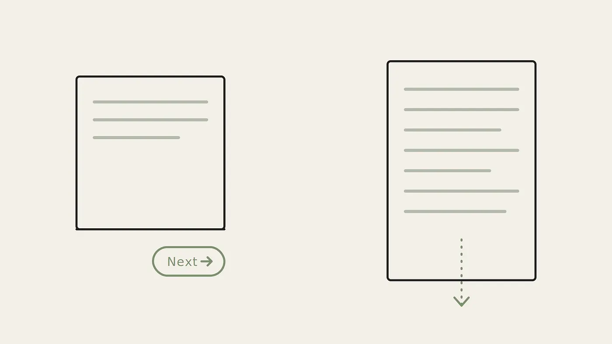

:::box
Có một âm thanh mà cả một thế hệ vẫn nghe lại được trong đầu chẳng chút khó nhọc. Tiếng modem quay số rít lên, cái âm ngân chập chờn như hai cỗ máy đang ngượng nghịu chào hỏi nhau, rồi một tiếng “tách”, rồi im lặng. Sau tiếng tách ấy, internet rời đi. Không phải thu nhỏ lại. Không phải lùi xuống chạy ngầm phía sau. Mà biến mất hẳn, đi đâu đó, trả bạn về căn phòng thật nơi bạn đang ngồi, nơi tiếng quạt máy tính chậm dần và tiếng đồng hồ treo tường bỗng nghe rõ trở lại.
:::

Đăng xuất từng là một hành động. Nó có động từ hẳn hoi. Bạn đóng một thứ lại, và ngày sống trở về với nhịp điệu khác của nó.

Sáng nay tôi thức dậy thì thế giới đã chạy tiếp từ lâu, đang dang dở giữa chừng. Chẳng có gì cần kết nối nữa. Các cuộc thảo luận đã trôi đi qua đêm, thông báo đã xếp hàng chờ sẵn trước cả khi mắt tôi kịp mở rõ, và vài cuộc trò chuyện tôi rời đi lúc đi ngủ giờ đã sang một hồi mới mà không có tôi. Sáng nay tôi không “đến” nơi nào cả, bởi đêm qua tôi chưa từng “rời đi”. Chẳng có cánh cửa nào tôi bước qua, dù theo chiều nào.

## Một nơi chốn biến thành một lớp phủ

Internet từng là một nơi chốn. Bạn ghé thăm nó. Có một hành trình nhỏ để đi vào: bật máy, kết nối, chờ đợi; rồi cũng hành trình nhỏ ấy để đi ra. Một nơi chốn thì có ranh giới. Chính ranh giới cho bạn biết khi nào mình ở trong và khi nào ở ngoài.

:::box
Giờ đây, internet không còn là nơi bạn đi tới. Nó là một lớp phủ lên cuộc sống, và bạn sống bên trong lớp ấy. Nó bám lấy buổi sáng, bàn ăn tối, hàng người chờ thanh toán, chiếc giường trước khi ngủ và ngay sau khi thức. Không còn chuyến ghé thăm nào, vì cũng chẳng còn sự trở về nào. Thứ đã chết dần một cách lặng lẽ, không một lời báo trước, là một khái niệm ta từng coi là hiển nhiên: *phiên* (session). Đó là một quãng thời gian có mở đầu và có kết thúc, một thứ khởi động, chạy, rồi dừng lại.
:::

")

Tôi muốn gọi đây là một mất mát mang tính cấu trúc, chứ không phải một thất bại của ý chí. Ta hay tự trách mình, như thể thứ còn thiếu là tính kỷ luật. Nhưng cánh cửa đã bị tháo khỏi bản lề mất rồi. Mà đã không có lối ra thì rất khó rời đi.

## Ai đã tháo cánh cửa đi

Đến đây tôi phải thành thật về chỗ đứng của mình, vì tôi không phải người ngoài cuộc đứng tiếc nuối từ xa.

:::box
Tôi làm việc ở phía dựng nên những thứ này. Trong sản phẩm số, ma sát (friction), tức mọi thứ làm người dùng khựng lại, bị xem là kẻ thù. Mỗi khoảng dừng, mỗi bước phụ, mỗi giây do dự đều là một điểm khiến người ta dừng, và “dừng” thì chúng tôi đo đếm dưới cái tên “rò rỉ người dùng”. Đăng xuất là kiểu ma sát gọn gàng nhất, một lời tạm biệt sạch sẽ. Mà trên mọi bảng số liệu tôi từng dán mắt vào, một lời tạm biệt sạch sẽ luôn hiện ra thành: một phiên kết thúc, tỷ lệ giữ chân tụt, lượt tương tác mất đi.
:::

Ngay cả một trang nội dung cũng từng có điểm kết. Nội dung được chia thành từng trang, cuối trang là nút “Next” (Trang sau). Nút ấy thật ra là một điểm để bạn quyết định: nó buộc bạn dừng một nhịp và tự hỏi, mình có muốn đọc tiếp không. Rồi cuộn vô tận (infinite scroll) ra đời và điểm quyết định ấy biến mất. Không phải vì nó hỏng, mà vì nó quá hiệu quả: nó khiến người ta dừng lại.

Có một điều chưa bao giờ được nói tới trong các buổi review: cái ma sát mà chúng tôi ra sức loại bỏ vốn có một cái tên khác ngay trong ngành của tôi. Anna Cox cùng đồng nghiệp gọi nó là *vi ranh giới* (microboundary): một chướng ngại nhỏ đặt ngay trước một thao tác, giữ cho ta khỏi lao vội từ việc này sang việc khác. Họ cho rằng thứ ma sát được đặt có chủ đích này có thể bẻ gãy chuỗi thao tác tự động, vô thức, và trả lại cho ta một khoảnh khắc để suy nghĩ. Họ phân biệt rõ điều này với thiết kế thao túng, loại phục vụ nhà cung cấp nhiều hơn người dùng.

Thế là chúng tôi tối ưu cho nó biến mất. Không phải vì ác ý, mà vì những ý định nghe rất xuôi tai: mượt hơn, nhanh hơn, gần hơn, luôn sẵn sàng. Mỗi cánh cửa gỡ đi, chúng tôi gọi là một cải tiến; và từng cánh, xét riêng, đều có lý. Cái thiếu trong phòng họp là câu hỏi: ngoài việc làm chậm mọi thứ, cánh cửa ấy còn làm gì khác nữa?

## Một cái tôi không bao giờ được dọn sạch

Có một cách rất kỹ thuật để thấy thứ đã mất, và tình cờ nó đúng là ngôn ngữ tôi dùng hằng ngày.

Trong một hệ thống máy tính, mỗi phiên có điểm đầu và điểm cuối. Bạn mở nó ra, một trạng thái (state) được tạo; bạn làm việc; rồi bạn đóng lại, và trạng thái ấy được dọn sạch. Bộ nhớ được giải phóng, mọi thứ tạm thời bị bỏ đi. Hệ thống trở về trạng thái nền yên tĩnh, chờ được lấp đầy lại vào ngày mai.

:::box
Đăng xuất từng làm đúng việc đó cho ta: nó dọn sạch trạng thái. Không phải bằng cách xoá ký ức, mà bằng cách buông những thứ tạm thời, đóng lại những gì không cần mang theo lên giường. Giờ thì chẳng gì được buông cả. Bảng tin nhớ chỗ bạn dừng. Sự hiện diện của bạn luôn được ghi là “đang online”. Thông báo xếp hàng để không sót một cái nào. Ta đã thành những tiến trình không bao giờ được dọn rác[^1]: luôn chạy, luôn ôm giữ mọi thứ từng mở ra, không bao giờ có một phút để trở về vạch xuất phát.
:::

")

Linda Stone đã đặt tên cho trạng thái này từ năm 1998: *chú ý phân mảnh liên tục* (continuous partial attention). Đó là khi sự chú ý bị xé lẻ không ngừng, mắt lúc nào cũng quét để khỏi bỏ lỡ điều gì, bị thôi thúc bởi ham muốn được làm một “nút sống” trên mạng lưới. Bà tách nó khỏi việc đa nhiệm, vì động cơ ở đây không phải năng suất mà là nỗi sợ bỏ lỡ (FOMO). Cái giá, theo bà, là một cảm giác khủng hoảng giả tạo nhưng dai dẳng, cùng khả năng suy ngẫm bị bào mòn dần.

Cái giá mà tôi thấy khó nhận ra nhất không hẳn nằm ở thời gian bị ngốn mất. Thời gian thì đúng là mất thật, nhưng đó là chuyện ai cũng nghe rồi. Cái sâu hơn là ta đánh mất khoảng nghỉ để hồi lại chính mình. Cái tôi vốn được phục hồi đôi chút giữa các phiên thì nay không bao giờ được đóng lại đủ lâu để hồi phục. Ta vác theo từng tab đang mở, suốt cả ngày, vào tận giấc ngủ.

## Đường ranh giới cuối cùng

Lần theo mạch ấy, một quy luật hiện ra. Đường ranh giới đầu tiên bị xoá là ranh giới giữa online và offline. Đường thứ hai là ranh giới giữa phiên này với phiên kế tiếp, khiến trạng thái không bao giờ được dọn sạch. Còn đường đang bị xoá ngay lúc này là đường sâu nhất: ranh giới giữa bạn và chính hệ thống.

:::box
AI không chỉ đơn thuần giữ bạn online lâu hơn. Nó thôi làm một nơi bạn ghé thăm, thôi làm một lớp bạn sống bên trong, và bắt đầu trở thành một người cùng tham gia. Nó nhớ những gì bạn nói hôm qua. Nó đoán câu kế tiếp của bạn trước cả khi bạn gõ. Nó học giọng của bạn và đáp lại theo đúng nhịp của bạn. Dần dần, nó thôi giống một công cụ bạn điều khiển, mà bắt đầu giống một thứ đang nghĩ cùng bạn.
:::

")

:::box
Đến lúc ấy, câu hỏi “đang online hay không” mất sạch ý nghĩa. Trước kia ta có một cuộc đời thứ hai trên nền tảng, tách biệt với cuộc đời ngoài màn hình. Điều đang xảy ra còn đi xa hơn thế. Không phải một cuộc đời thứ hai, vì chẳng còn cái “thứ hai” nào nữa: không còn kia và đây, không còn vào và ra, không còn tôi và màn hình. Chỉ còn lại một mặt phẳng hợp nhất duy nhất, với một hệ thống nhớ về một ngày của bạn nhiều hơn cả chính bạn, và nói giống bạn đến mức bạn quên mất lúc nào mình đã nhường cho nó việc suy nghĩ.
:::

## Mượt mà chưa bao giờ là toàn bộ đề bài

Điều kỳ lạ, nếu thành thật với bản thân, là ngành này đã biết câu trả lời từ lâu. Chúng tôi chỉ chọn cái phần dễ bán hơn mà thôi.

Mark Weiser, cha đẻ của khái niệm điện toán hiện diện khắp nơi (ubiquitous computing[^2]), chưa bao giờ nói mục tiêu là “liền mạch”. Ông cảnh báo rằng làm mọi thứ liền mạch cũng là làm mọi thứ na ná như nhau, và ông ủng hộ những hệ thống để lộ các mối nối (seamful), tức loại để mỗi bộ phận vẫn được là chính nó. Chalmers và MacColl phát triển ý này thành một lập trường thiết kế hẳn hoi: nghi ngờ cái mặc định rằng “liền mạch” là điều bắt buộc, và cho rằng những mối nối lộ ra có khi lại hữu ích, thậm chí được người dùng tận dụng theo cách riêng của họ.

Weiser, cùng John Seely Brown, cũng đã gọi tên phương thuốc từ rất lâu trước khi căn bệnh nặng đến mức này. Đó là công nghệ điềm tĩnh (calm technology): loại công nghệ đưa thông tin cho bạn mà không đòi bạn phải dồn hết tập trung, chịu nằm yên ở rìa sự chú ý và chỉ bước vào giữa khi thật cần. Amber Case đúc kết nó thành một câu đáng dán lên tường mọi phòng làm sản phẩm: việc chính của một con người không nên là loay hoay với máy móc, mà là được sống cho ra con người.

## Dừng lại là một việc của thiết kế

Vậy rốt cuộc thì sao? Phần tiếp theo này khiến một người như tôi thấy khó chịu.

Bấy lâu nay ta vẫn coi chuyện không dừng lại được là lỗi ở ý chí người dùng. Thế nên “toa thuốc” luôn là: detox kỹ thuật số đi, tắt máy đi, lên núi đi, cứ như thể thứ còn thiếu là sự tự kỷ luật. Nhưng cánh cửa đã bị lấy đi, và người lấy nó không phải người dùng. Dừng lại không phải một thất bại của ý chí. Dừng lại vốn là một tính năng có sẵn của phương tiện, thứ mà chúng tôi đã gỡ bỏ chỉ vì nó hiện lên như một chỗ “rò rỉ” trên bảng số liệu.

:::box
Nếu đúng vậy thì một phần công việc thiết kế phải thay đổi. Nó không dừng ở chỗ loại bỏ ma sát nữa, mà phải đi tới một câu hỏi khó hơn: ta nên chủ động dựng lại những lối ra nào? Đặt lại một tín hiệu dừng. Cài một vi ranh giới vào đúng chỗ cần có. Cho một cái kết được phép cảm thấy như một cái kết. Và đây mới là phần nặng nề: gần như mỗi quyết định kiểu đó đều thua khi đặt cạnh chỉ số tương tác. Dựng một lối ra nghĩa là chủ động chấp nhận một con số nhỏ hơn hôm nay, để đổi lấy một con người còn nguyên vẹn vào ngày mai.
:::

")

:::box
Cánh cửa rồi cũng được dựng lại, và đáng để xem nó được dựng ở đâu. Tại châu Âu, cơ quan quản lý đã bắt đầu coi kiểu thiết kế “gây nghiện tương tác” là một dạng vi phạm. Ủy ban châu Âu kết luận rằng tính năng cuộn vô tận và tự động phát của TikTok vi phạm Đạo luật Dịch vụ Số (Digital Services Act), và phát tín hiệu rằng công ty có thể buộc phải sửa lại chính thiết kế cốt lõi, với mức phạt có thể lên tới 6% doanh thu toàn cầu. Cũng chính cơ quan ấy gạt bỏ những cảnh báo thời lượng màn hình mà TikTok vốn đã có, vì cho rằng chúng quá yếu.
:::

Nói cách khác: giải pháp “gắn thêm cho có” đã công khai thất bại, và động cơ thay đổi giờ phải được áp từ bên ngoài vào, kèm một con số đủ lớn để buộc người ta để tâm. Ở chỗ khác, cánh cửa được bán như một món hàng riêng: những chiếc điện thoại cố tình không có dòng tin (feed), hay một chứng nhận “công nghệ điềm tĩnh” chấm điểm sản phẩm dựa trên việc chúng chịu nằm ở rìa hay nhảy vào giữa. Lại có những công cụ như *one sec*, chèn một nhịp thở vào giữa bạn và ứng dụng bạn quen tay mở ra; trong một nghiên cứu được bình duyệt, nó giúp giảm hơn một nửa số lần mở app. Một vi ranh giới, được đóng gói thành sản phẩm.

:::box
Nhưng hãy để ý ai là người dựng từng cánh cửa đó. Một cơ quan quản lý thay đổi cái giá phải trả. Một tổ chức tiêu chuẩn nghĩ ra một động cơ mới. Một hãng phần cứng bán đi chính sự vắng mặt của dòng tin. Một người dùng tự tay cài thêm ma sát lên ứng dụng vốn chẳng đời nào tự thêm. Bên gần như luôn vắng mặt trong danh sách đó chính là các nền tảng đang sống nhờ sự tương tác. Lối ra luôn được dựng từ bên ngoài, bởi ở bên trong, động cơ vẫn chỉ về hướng ngược lại. Đó là cơ chế nằm dưới tất cả những điều này, và nó càng cho thấy phần trách nhiệm của chính tôi: những người ở vị trí tốt nhất để gắn lại cánh cửa lại là những người có ít lý do nhất để làm điều đó.
:::

Với AI, mức cược lại tăng thêm một bậc, và “công nghệ điềm tĩnh” từ một ý tưởng cũ bỗng thành một nguyên tắc cấp bách. Câu hỏi thiết kế không phải là hệ thống này nghĩ hộ bạn giỏi đến đâu, mà là nó có chịu trả lại lượt cho bạn hay không. Nó chịu nằm ở rìa và chỉ bước vào giữa khi cần, hay nó kéo tất cả vào giữa rồi không bao giờ buông ra? Một hệ thống tốt sẽ cho ta cảm giác nó biết khi nào nên im lặng.

Tôi không có sẵn một danh sách đầy đủ. Tôi không biết chính xác những ranh giới nào ta nên từ chối xoá đi, và tôi ngờ rằng có những ranh giới chỉ lộ ra khi đã mất rồi. Đó là điều thành thật nhất tôi viết được ở đây: người đang góp tay vào cuộc hợp nhất này vẫn chưa biết phần nào lẽ ra nên được giữ lại, đừng hợp nhất.

Tôi không đòi mang lại thời quay số. Tôi chẳng hề nhớ cảnh ngồi chờ cả phút cho một trang web. Nhưng sự im lặng sau tiếng “tách” ngày ấy đã làm một việc mà ta chưa bao giờ tính đến: nó cho mỗi ngày một đường viền, và chính đường viền đó khiến “ở đây” thật sự là ở đây. Trước kia thứ đó đến miễn phí, như một đặc tính sẵn có của phương tiện. Còn bây giờ thì chẳng gì đến miễn phí nữa.

Vậy nên câu hỏi đáng mang theo không phải là “làm sao để tôi đăng xuất”. Cánh cửa không còn nữa rồi. Câu hỏi là: liệu chúng ta, những người thiết kế nên cái bề mặt mà người khác sống cả đời trên đó, có sẵn lòng chủ động dựng lại đường viền ấy hay không, dù mọi động cơ đều bảo ta đừng làm.

:::box
Ngày trước ta đăng xuất được vì có ai đó để ngỏ cánh cửa. Còn bây giờ, nếu người ta vẫn được phép có lấy một khoảnh khắc để dừng, thì chính chúng ta là những người phải đặt cánh cửa vào đó. Và ta nên hiểu rõ vì sao nó đáng được gắn lại, trước khi ta quên mất rằng nó từng tồn tại mà chẳng cần ai phải hỏi.
:::

[^1]: **Dọn rác** (garbage collection): cơ chế trong lập trình tự động thu hồi vùng nhớ không còn dùng tới, để máy khỏi đầy bộ nhớ.
[^2]: **Điện toán hiện diện khắp nơi** (ubiquitous computing): ý tưởng máy tính hoà vào mọi vật quanh ta, có mặt ở khắp nơi mà gần như vô hình.
