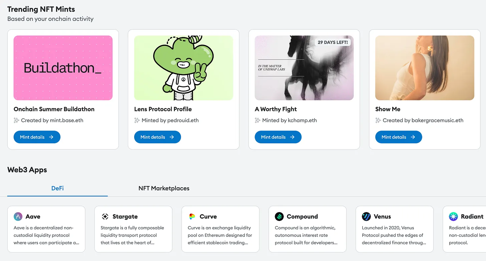

. Cuối cùng thì nó cũng đang thành hiện thực.")

:::quote{cite="Herbert Simon, Designing Organizations for an Information-Rich World"}
Trong một thế giới giàu thông tin, sự dồi dào của thông tin đồng nghĩa với sự thiếu hụt của một thứ khác: sự khan hiếm của bất cứ thứ gì mà thông tin tiêu thụ. Thứ mà thông tin tiêu thụ thì khá rõ ràng: nó tiêu thụ *sự chú ý* của những người tiếp nhận. Do đó, một sự dồi dào thông tin tạo ra sự nghèo nàn về chú ý, cùng nhu cầu phân bổ sự chú ý đó một cách hiệu quả giữa vô số nguồn thông tin có thể tiêu thụ nó.
:::

“Quảng cáo” (ads) là một từ xấu trong giới crypto, ấy vậy mà (gần như) mọi thứ trong crypto đều là quảng cáo. Mỗi lượt mint được chia sẻ trên Farcaster đều là một quảng cáo: người giới thiệu sẽ ăn một phần phí mint. Cái link trong kênh Discord hay Telegram của bạn trỏ tới một sàn DEX mới cũng là quảng cáo: người đăng đang nhận tới hơn 10% phí giao thức của bạn qua chương trình giới thiệu. Mỗi memecoin là một quảng cáo cực kỳ chính xác, một chiếc phong vũ biểu tự đo lường sự chú ý: giá lên nếu người ta bàn tán về nó và xuống nếu họ im lặng. Crypto, về mặt tinh thần, bị ám ảnh bởi tiền hơn nó tưởng, và còn hơn cả Web2 thuở mới ra đời; những cỗ máy kiếm tiền của Web2 được dựng lên như một giải pháp chữa cháy muộn màng.

Hôm nay chúng tôi công bố hợp tác giữa Spindl, Daylight, Serotonin và Collab.land: một sự kết hợp độc đáo giữa các nhà xuất bản (publisher), công nghệ kiếm tiền và một agency marketing trọn gói. Tổng hoà lại, đây là một điều chưa từng có: khả năng khuyến khích người dùng (và các ứng dụng của họ) trên toàn bộ chiều dài của phễu marketing, từ một trải nghiệm tiêu dùng sẵn có đến một giao thức mới (đối với họ), mà *hoàn toàn không cần* đến công nghệ quảng cáo Web2 cũ kỹ.[^1]

Cho tới nay, gần như chẳng có gì đáng kể về mặt công nghệ quảng cáo onchain. Một loạt cái gọi là “mạng quảng cáo web3” thực ra chỉ là công nghệ quảng cáo web2 rất sơ đẳng được chạy trên các publisher hướng crypto: tấm banner đặt trên một trang quét chuỗi (chain scanner) hay một website vẽ biểu đồ giá token. Chẳng có gì onchain một cách nguyên bản ở chúng cả, và quảng cáo của chúng thường chuyển đổi rất kém.

Vẫn có các phương án thay thế: những công ty như Addressable dùng blockchain để dựng nên các tập khán giả (audience) có thể nhắm mục tiêu, rồi tìm các tập khán giả đó trên các publisher Web2 như Twitter, Reddit và toàn bộ phần còn lại của Web (đây là mặt đối ứng của những gì việc attribution của Spindl làm, và đó cũng là lý do chúng tôi hợp tác riêng với họ). Đó là một cây cầu thiết yếu, và sẽ còn hữu ích chừng nào Web2 còn tồn tại, nhiều khả năng là mãi mãi.

Nhưng có một điều mới đang chuyển động: Web3 tiêu dùng (consumer) cuối cùng cũng đang xảy ra. Farcaster đang xảy ra, vô số client của nó như Warpcast, Supercast và Phaver đang xảy ra. Những chiếc Coinbase Smart Wallet vốn cấp ví liền mạch chỉ với một lượt đăng nhập mạng xã hội đang xảy ra. Privy, Dynamic và các ví nhúng (embedded wallet) cũng đang xảy ra. Các publisher và phương tiện truyền thông onchain nguyên bản cuối cùng cũng đang xảy ra. Hàng triệu người dùng mới sẽ ở trên onchain, dù họ có nhận ra điều đó hay không.

Từ góc nhìn marketing, điều này có nghĩa là: trong khi phần lớn hoạt động onchain cho tới nay nằm ở *đáy* phễu người dùng, người dùng đặt chân tới trang của một dự án, kết nối ví, và chỉ khi đó mới giao dịch onchain, thì giờ đây *đỉnh* phễu cũng đã onchain: người dùng có thể giao dịch một cách nguyên bản ngay trên bất kỳ giao diện nào họ chạm tới. Điều này thay đổi tất cả về cách người dùng được thu hút.

Hãy thử hình dung: Amazon sẽ trả bao nhiêu cho một tấm banner một-cú-nhấp cho phép bạn mua ngay món hàng đã bỏ lại trong giỏ Amazon, trong khi đang lướt *The New York Times*? Họ sẽ trả hàng tỷ và hàng tỷ đô, xét tới tác động lên tỷ lệ chuyển đổi. Nhưng một thứ như vậy gần như không thể dựng được bằng công nghệ Web2 truyền thống.[^2]

: web, mobile, bất kể nền tảng nào.")

Nó dễ dựng đến mức trong Web3 ai ai cũng từng nghịch thử việc xây phiên bản crypto của thứ này. Nó được gọi là Frames và ra mắt trên Farcaster hồi tháng Hai vừa qua. Đám “quái vật” này nhiều đến nỗi Warpcast (client Farcaster lớn nhất) phải có hẳn một feed riêng dành cho Frames chỉ để chứa hết.

Giờ hãy hình dung một trải nghiệm người dùng tương tự, đặt ngay bên trong một ứng dụng tiêu dùng, được nhắm mục tiêu chính xác qua một tập khán giả dựa trên ví và được dẫn dắt bởi các giao dịch onchain, được quy kết (attribute) chính xác qua đo lường onchain, và được thanh toán bằng chính các đường ray thanh toán onchain nguyên bản chấp nhận token giao thức của bạn.

Đó chính là thứ Spindl ra mắt hôm nay cùng mạng lưới publisher của mình: một hệ thống hợp nhất giữa nhắm mục tiêu, attribution và thanh toán, thứ rốt cuộc hoàn thiện trọn vẹn bánh đà (flywheel) marketing.

Tất nhiên, khi nói “quảng cáo”, chúng tôi không hề ám chỉ những tấm banner xấu xí phiền phức hay các pop-up khó chịu của web2. Chúng tôi muốn nói tới một lời kêu gọi hành động (call to action) được tài trợ, đặt đúng ngữ cảnh, nguyên bản và liên quan, giống như những đơn vị bên dưới đặt trong một ví Web phổ biến:

Những đơn vị này được tạo và quản lý bởi Daylight, một trong các đối tác của chúng tôi, vốn chuyên hiển thị (surface) các đợt airdrop và NFT mint ngay bên trong các trải nghiệm hướng người tiêu dùng trên nhiều ứng dụng ví hàng đầu. Mạng lưới ví đối tác của họ bao gồm khoảng vài triệu ví đang giao dịch, mạng lưới publisher onchain lớn nhất thuộc loại này.

**Nhưng chúng có thật sự hiệu quả không?**

Liệu bạn có thể giao hàng, ở đây là những người dùng thực sự chịu chi tiền, đồng thời khiến điều đó đáng công đáng sức với publisher hay không?

Cho đến nay, câu trả lời là một tiếng “có” vang dội. Đơn vị quảng cáo bạn thấy ở trên, được tạo bên trong quy trình đăng nhập của Collab.land vốn được hơn 5.000 server Discord sử dụng, tạo ra tỷ lệ nhấp (clickthrough) ổn định trên 10% xuyên suốt nhiều nhà quảng cáo. CPM hiệu dụng tương ứng (mức kiếm tiền cho mỗi quảng cáo như vậy) đã có lúc đạt đỉnh tới 50 đô CPM (và không thấp hơn 10 đô CPM) với nhiều chiến dịch đang chạy, vượt xa CPM trung bình của một hệ thống quảng cáo Web2 cũ.

Collab.land dự định chia sẻ doanh thu quảng cáo của mình với các moderator của Discord, tưởng thưởng những người đã duy trì các cộng đồng tồn tại lâu dài, trên tinh thần tình nguyện. Gần đây, Telegram đã thông báo họ chia sẻ doanh thu quảng cáo với các moderator của kênh tại nơi quảng cáo xuất hiện, biến những cộng đồng đó thành những doanh nghiệp có thể tự nuôi sống mình.

 chạy trong luồng đăng nhập của Collab.land.")

Sơ đồ thô sơ ở đầu bài của chúng tôi không phân biệt loại publisher: dù là một nhà xuất bản truyền thông quy ước, một moderator kênh, hay một influencer. Blockchain có nghĩa là bất cứ ai sở hữu một tập khán giả đều có thể được tưởng thưởng vì điều đó, bất kể quy mô lớn nhỏ. Lại một lần nữa, đây là điều sẽ rất khó hoặc bất khả thi để dựng nên trên internet offchain.

Web3 tiêu dùng đã đến rồi, và sẽ có ai đó phải trả tiền cho nó. Chi phí máy chủ còn kham được khi bạn có 10.000 người dùng hoạt động hằng tháng (MAU), nhưng sẽ không kham nổi khi con số là 100 triệu. Spindl, cùng các đối tác mạng lưới của mình, đang xây dựng phương tiện để làm đúng điều đó, bạn sẽ không thể tạo ra một internet onchain mới nếu thiếu nó.

Nếu bạn là một publisher hay nhà quảng cáo muốn tìm hiểu thêm về mạng lưới, hãy liên hệ với chúng tôi. Để đọc thêm về marketing Web3, hãy đăng ký theo dõi Spindl Blog!

[^1]: Dành cho dân crypto đang nghĩ: chẳng phải đây nên là một thị trường hai phía, với các publisher mang người dùng của mình tới những dự án sẵn sàng chi tiền để thu hút người dùng mới, hay sao? Đúng, nó nên như vậy, rất nên là như vậy. Hãy chờ xem.
[^2]: Thứ gần nhất với điều này mà chúng ta đang có là TikTok Shopping, vốn gọi Apple Pay khi bạn muốn mua một sản phẩm thấy trong video. Ở đó, hệ điều hành di động (và thông tin thanh toán đã lưu của bạn) đóng vai thay cho danh tính và đường ray thanh toán của blockchain. Phải mất tới chừng hai thập kỷ internet mới đến được đó.
